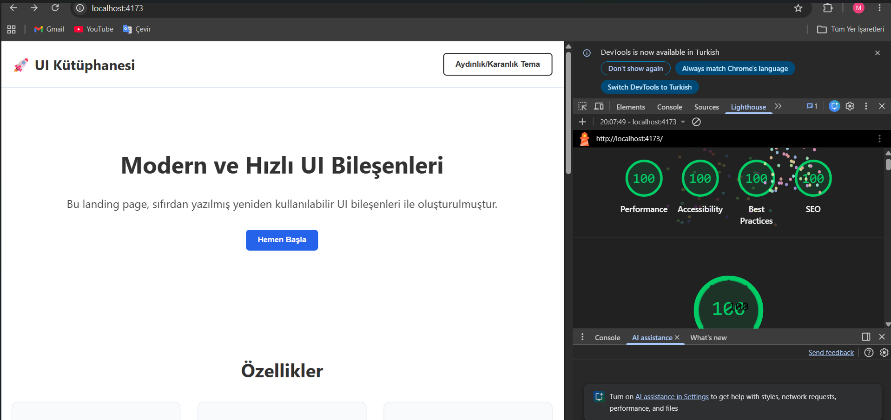

# UI Bileşen Kütüphanesi ve Landing Page

Bu proje, 20 iş günlük zorunlu yaz stajı çalışmaları kapsamında, modern web teknolojileri kullanılarak sıfırdan geliştirilmiş bağımsız bir UI bileşen kütüphanesi ve tanıtım sayfasıdır. 
## 🌐 Canlı Demo
[Projeyi buradan inceleyebilirsiniz](https://staj-projesi-final.vercel.app).
## 🛠 Kullanılan Teknolojiler ve Mimari
* **Altyapı:** Vite
* **Stil Mimarisi:** SCSS ve BEM metodolojisi
* **Etkileşim:** Vanilla JavaScript (Harici kütüphane kullanılmamıştır)
* **Responsive:** Mobil öncelikli (Mobile-first) yaklaşım (≤640px, 641-1024px, ≥1025px)

## 📦 Bileşenler
Tüm bileşenler modüler olarak ayrı SCSS dosyalarında tasarlanmıştır:
1. Button (Primary ve Outline)
2. Card (Grid altyapılı)
3. Accordion (Dinamik yükseklik hesaplamalı SSS)
4. Modal (Tam ekran overlay ve klavye destekli)
5. Form (Vanilla JS anlık doğrulamalı)

## 📊 Performans (Lighthouse)
Lighthouse testlerinde Performans, Erişilebilirlik, Best Practices ve SEO alanlarında tam puan elde edilmiştir. 

